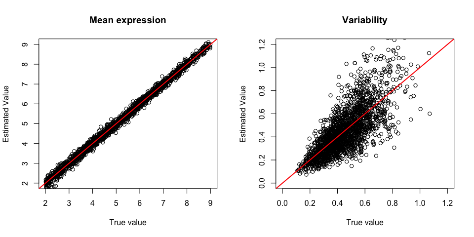
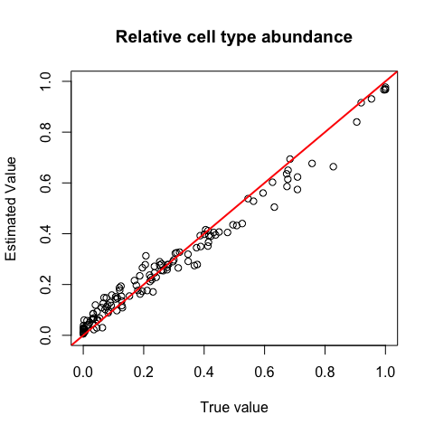

# Immune Cell-Type Estimation Reveals Intratumor heterogeneity

## Description

This package is designed to infer relative cell type abundance and its
variability across bulk tumor samples obtained from a multi-region
sequencing design. ICeITH is a reference-based deconvolution method and
it overcomes the limitations of current methods by modeling a
patient-specific mean expression to account for the heterogeneity of
gene expressions introduced from multi-region sequencing design. In
addition, ICeITH measures the intratumor heterogeneity by quantifying
the variability of targeted cellular composition and it potentially
reveals the relation with the risk of patients’ survival.

## Installation

To install the package:

``` r
install.packages('devtools')
devtools::install_github("pengyang0411/ICeITH")
```

## Usage

### Data simulation

To demonstrate the usage of ICeITH package, we provide a function
`sim_func` to simulate the multi-region gene expression data and the
cell-type-specific reference profiles.

``` r
library(ICeITH)
simData <- sim_func(K = 4,      ## Number of cell types
                    G = 500,    ## Number of genes
                    lowS = 3,   ## Minimal number of samples per subject
                    maxS = 5,   ## Maximal number of samples per subject
                    N = 10,     ## Number of patient subject
                    nRef = 100) ## Number of reference for each cell types
```

`simData` is a list contains the cell-type-specific expression profies
as well as the mixed multi-region gene expression and the intratumor
heterogeneity for each patient subject.

Various other options are available and the detailed description of the
output values are well documented in the help pages

``` r
?ICeITH::sim_func
```

### Reference profie estimation

The first step of the model estimation is to obtain the prior knowledge
(i.e., cell-type-specific mean expression and variability of each gene)
from the reference profile using `refEst` function. It needs needs a
cell-type-specific gene expression matrix and a vector the label the
cell type for each sample.

``` r
## Estimate the reference
reference = refEst(simData$X_gr,       ## Reference matrix
                   cts = simData$ct_s) ## Reference cell types
```

The estimation results are displayed:


For more details, please review the help page:

``` r
?ICeITH::refEst
```

### Model estimation

The second step of the model estimation is to quantify the relative
cell-type abundance and the classification of intratumor heterogeneity
level by using `ICeITH` function. It requires an input of multi-region
gene expression data from a cohort and the sample index to the patient
subject:

``` r
## Estimate the model
res_All = ICeITH(Y = simData$Y,            ## Multi-region gene expression data
                 reference = reference,    ## Prior knowledge from reference
                 sampIndex = simData$I_i,  ## Sample index
                 maxIters = 20)            ## Maximum number of iterations
```

    ## Loading required namespace: e1071

    ## Iteration: 1  objective value:  -241177.1 
    ## Iteration: 2  objective value:  -237713.6 
    ## Iteration: 3  objective value:  -237628.9 
    ## Iteration: 4  objective value:  -237625.5 
    ## Iteration: 5  objective value:  -237625.5 
    ## Converged

The estimated relative cell-type abundance are displayed:


## Maintainer information

Peng Yang ([py11@rice.edu](mailto:py11@rice))

## Citation
